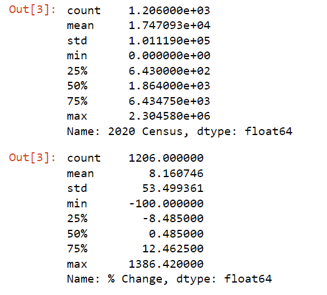
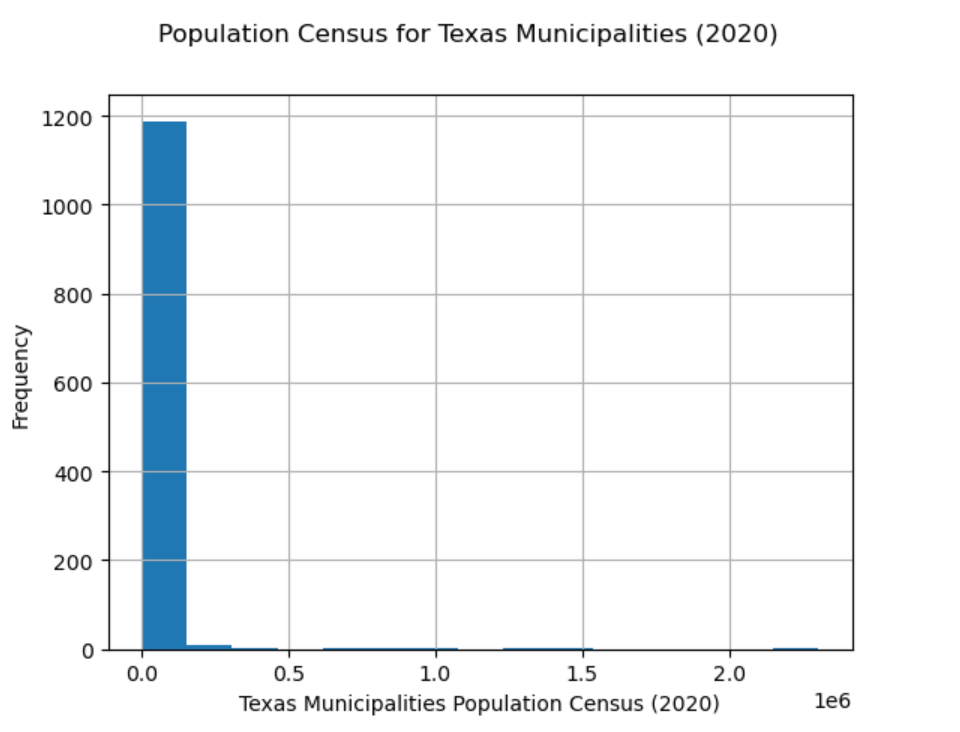
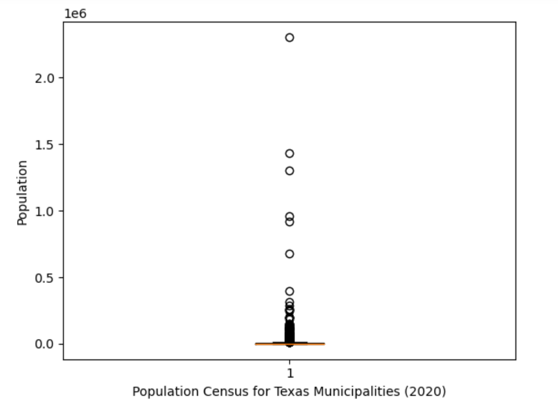

# I310D_Assignment7
This is the repository specifically for Assignment 7: Data Curation and Analysis.

GOAL: To extract population data from the many different municipalities in Texas, clean the data, and lastly perform analysis on it, like analyzing the percent change of each Texas municipality and comparing the differences in population census between the top 10 Texas municipalities.

LICENSE: MIT License

SOURCE DATA: https://en.wikipedia.org/wiki/List_of_municipalities_in_Texas

DATA DICTIONARY (name, description, datatype):      
----------------------------------------------------------------------------------
- 2021 Rank: the rank of the city in 2021 based on the population, datatype: int
- Municipality: the municipality name, datatype: string
- Designation: whether the municipality was a city, village, or town, datatype: string
- Primary County: the county name of where the municipality was location, datatype: string
- 2021 Estimate: the population estimate of the municipality in 2021, datatype: int
- 2020 Census: the population census of the municipality in 2020, datatype: int
- 2010 Census: the population census of the municipality in 2010, datatype: int
- % Change: the municipality percent of population change between 2020 and 2021, datatype: float

ANALYSIS: 

- From the clean dataset, I analyzed the columns "Municipality", "% Change", and "2020 Census"
- I found the Descriptive Statistics for both "% Change" and "2020 Census", with were both numerical variables
- Here are the Descriptive Statistics for both "% Change" and "2020 Census"

- I also brought the columns "Municipality" and "2020 Census" together to analyze in barchart form

VISUALIZATIONS:

- Here is the Histogram of the 2020 Census data for Municipalities in Texas
- I wanted to analyze the differences in population for different municipalities in Texas 

- Here is the Histogram of the %Change (2010-2020) for Municipalities in Texas
- I wanted to analyze the differences in percent change for different municipalities in Texas and see how vast they were in Histogram form

- Here is the Boxplot of the 2020 Census data for Municipalities in Texas
- I wanted to analyze the differences in population for different municipalities in Texas in boxplot form and see if outlier occured with the grouping of the points 

- Here is the Boxplot of the %Change (2010-2020) for Municipalities in Texas
- Similarly, I wanted to analyze the differences in percent change for different municipalities in Texas in boxplot form and see if outlier occured with the grouping of the points 

- Lastly, here is a Barchart between the Texas Municipality and 2020 Census Data
- I wanted to see the top 10 municipalities of Texas in 2020 and compare the population census data between them to see if the differences were vast in barchart form

ISSUES:
- Some datapoints were omitted due to having a "-" or null values in the columns with the 2020 and 2010 census
- This dataset only contains population information from 2020, 2021, and 2010
- The data is not normal due a skew in population with municipalities such as Houston, Dallas, and San Antonio.

NOTES:
- Used modules/APIs such as pandas, BeautifulSoup, requests, matplotlib, numpy
- Link to BeautifulSoup Documentation: https://www.crummy.com/software/BeautifulSoup/bs4/doc/
- Link to pandas Documentation: https://pandas.pydata.org/docs/
- Link to matplotlib Documentation: https://matplotlib.org/stable/index.html
- Link to requests Documentation: https://requests.readthedocs.io/en/latest/
- Link to NumPy Documentation: https://numpy.org/doc/
- 1200+ datapoints, with 8 attributes